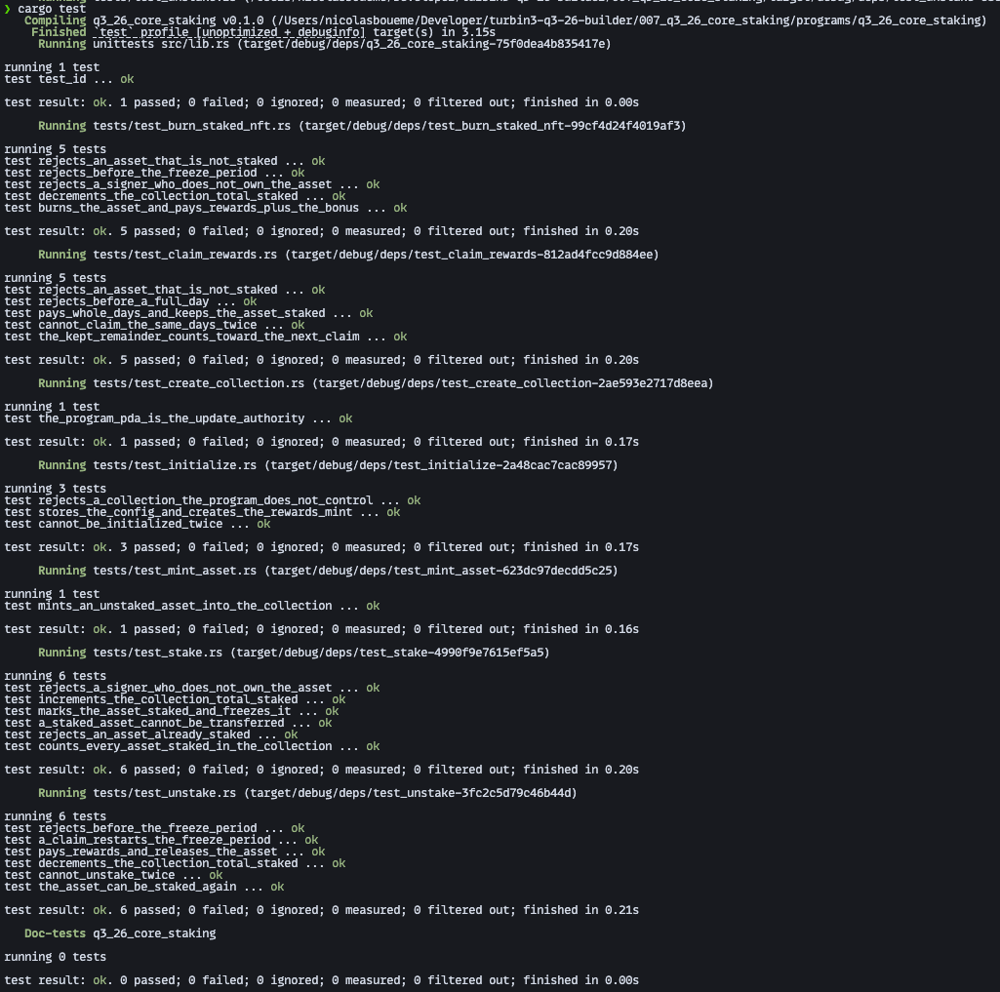

# Q3-26 Core Staking

An Anchor program for staking Metaplex Core NFTs without leaving the owner's wallet. Staking is a state change on the asset itself: the program writes `staked` / `staked_at` Attributes and freezes it with a `FreezeDelegate`, so the NFT cannot move until it is unstaked. Stakers earn a program-minted reward token per whole day staked, can claim without unstaking, and can burn a staked NFT for a one-time bonus. The collection keeps a live `total_staked` counter as an Attribute. Built for the Turbin3 Q3 2026 Builder cohort.

Lifecycle: `create_collection` → `initialize` → `mint_asset` → `stake` → `claim_rewards` ⇄ … → `unstake` **or** `burn_staked_nft`

## Instructions

| Instruction         | Args                                     | Effect                                                                                               |
| ------------------- | ---------------------------------------- | ---------------------------------------------------------------------------------------------------- |
| `create_collection` | `name: String`, `uri: String`            | Creates an MPL Core collection whose update authority is the program's `update_authority` PDA        |
| `initialize`        | `rewards_bps: u16`, `freeze_period: u16` | Creates `Config` and the 6-decimal rewards mint for a collection the program controls                |
| `mint_asset`        | `name: String`, `uri: String`            | Mints an asset into the collection to the signer                                                     |
| `stake`             | —                                        | Sets `staked = true` and `staked_at = now`, adds a `BurnDelegate` and a frozen `FreezeDelegate`, increments `total_staked` |
| `claim_rewards`     | —                                        | Mints rewards for the whole days since `staked_at` and advances it by those days; the asset stays staked |
| `unstake`           | —                                        | After `freeze_period` days: thaws, removes both delegates, resets the attributes, mints rewards, decrements `total_staked` |
| `burn_staked_nft`   | —                                        | After `freeze_period` days: thaws and burns the asset, mints rewards plus `BURN_BONUS` (1,000 tokens), decrements `total_staked` |

Rewards are `days × rewards_bps / 10_000` whole tokens per asset, so `rewards_bps = 10_000` pays one token a day. An unstaked asset can be staked again.

## Accounts

| Account            | Seeds / derivation                  | Type                                                |
| ------------------ | ----------------------------------- | --------------------------------------------------- |
| `config`           | `[b"config", collection]`           | `Config` (8 + 6 bytes)                              |
| `update_authority` | `[b"update_authority", collection]` | Signer-only PDA, no data                            |
| `rewards_mint`     | `[b"rewards_mint", config]`         | `InterfaceAccount<Mint>`, 6 decimals, authority `config` |
| `user_rewards_ata` | ATA of `rewards_mint` for `owner`   | `InterfaceAccount<TokenAccount>`                    |

`Config` stores `rewards_bps`, `freeze_period`, `rewards_bump` and `bump`. Staking state lives on MPL Core accounts, not in the program:

- **Asset Attributes:** `staked` (`"true"` / `"false"`) and `staked_at` (unix timestamp, `"0"` once unstaked)
- **Collection Attribute:** `total_staked`

The rewards ATA is not created by the program. The owner creates it before the first claim, unstake or burn.

## Errors

| Code | Name                     | Raised when                                                                           |
| ---- | ------------------------ | ------------------------------------------------------------------------------------- |
| 6000 | `InvalidOwner`           | The signer does not own the asset                                                     |
| 6001 | `InvalidUpdateAuthority` | The collection's update authority is not the program PDA, or the asset is not in the collection |
| 6002 | `AlreadyStaked`          | `stake` is called on an asset already staked                                          |
| 6003 | `AssetNotStaked`         | `claim_rewards`, `unstake` or `burn_staked_nft` is called on an asset that is not staked |
| 6004 | `InvalidTimestamp`       | `staked_at` is not a valid timestamp, or the time arithmetic overflows                |
| 6005 | `FreezePeriodNotElapsed` | `unstake` or `burn_staked_nft` is called before `freeze_period` whole days since `staked_at` |
| 6006 | `InvalidRewardsBps`      | The reward amount overflows `u64`                                                     |
| 6007 | `NoRewardsToClaim`       | `claim_rewards` is called before one whole day since `staked_at`                      |
| 6008 | `InvalidTotalStaked`     | The collection's `total_staked` is not a number, or would go below zero               |

## Build & test

```bash
anchor build   # required: the tests load target/deploy/q3_26_core_staking.so
cargo test
```



27 tests across the seven instructions. They cover the full stake → claim → unstake / burn cycle, the freeze period and whole-day boundaries, restaking, the `total_staked` counter across several assets, and every owner and state guard. They run in-process on [LiteSVM](https://github.com/LiteSVM/litesvm) — no validator, no devnet, no airdrops. The Clock sysvar is moved forward to simulate days of staking. LiteSVM does not bundle MPL Core, so the tests load its mainnet binary from `programs/q3_26_core_staking/tests/fixtures/mpl_core.so`.

Built with Anchor 0.32.2 and mpl-core 0.12.1, whose latest release does not support Anchor 1.x yet.
